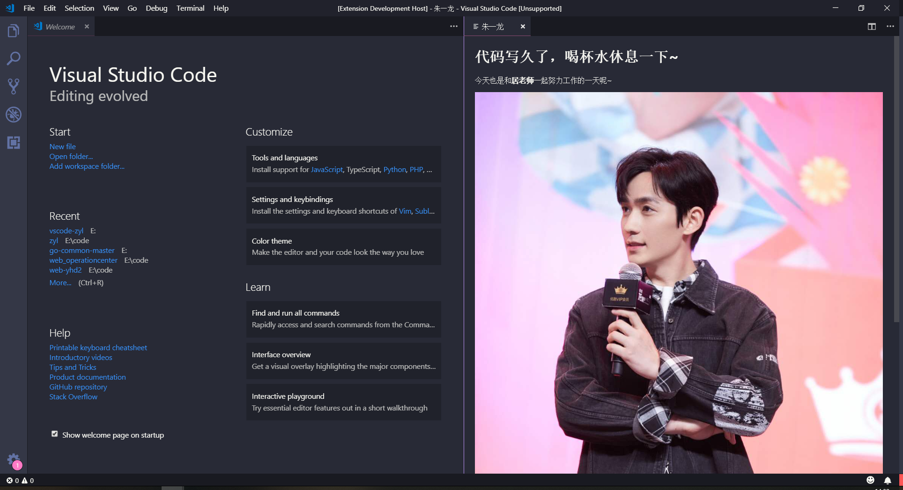

# 居老师鼓励师

在 VS Code 中连续写代码一小时（时间可配置），会有居老师提醒你该休息啦~

## 使用

除了每过一小时会自动弹出提醒页面，也可以按 `F1`, 然后输入 `zyl: 打开提醒页面`来打开提醒页面



## 配置

* `zyl.reminderViewIntervalInMinutes`: 展示提醒页面的时间间隔（分钟）。(默认值为**60**)
* `zyl.title`: 提示文字。 (默认值为**代码写久了，喝杯水休息一下~**)
* `zyl.content`: 提示内容，支持html标签。 (默认值为**今天也是和居老师一起努力工作的一天呢~**)
* `zyl.type`: default (默认图)；url (图片地址)。(默认值为**default**)
* `zyl.customImages`: 配置图片数组（需要搭配zyl.type为url） (默认值为**默认图片**)

```
如下例子，使用自定义图片：
"zyl.type": "url",
"zyl.customImages": [
    "http://zyl.jpg"
]
```
## 如何使用本地图片作为展示图片

* vscode不允许读取外部文件路径，所以只能自己去替换插件内的图片。替换步骤如下：
  
  1、找到vscode插件安装的地方 (如mac 在~/.vscode/extensions/yanzilulu.zyl-{version})
  
  2、替换images/zyl内图片
